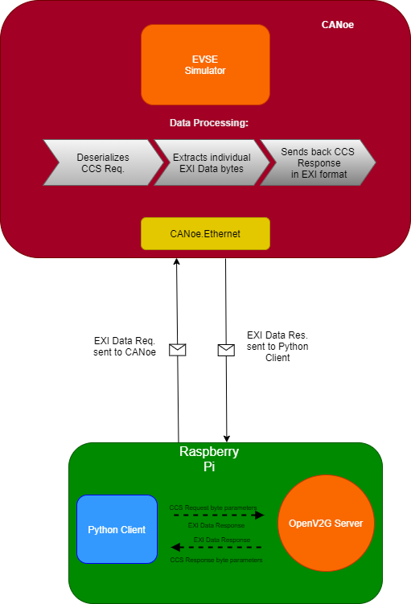
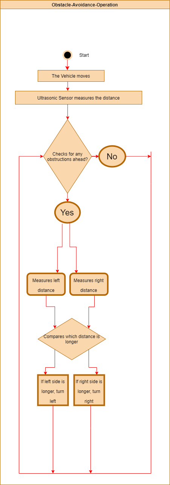

# Electric Vehicle Charging Protocol Implementation (Final Year Project)

The desired goal of this Project was to implement the communication which occurs between an electric vehicle (EV) and a charging station during the charging process using the Combined Charging System (CCS) protocol. The Electric Vehicle Supply Equipment (EVSE) is run in Vector's CANoe Software and simulates a Charging Station connected to the electrical grid. The purpose of the charging station is to communicate with the Raspberry Pi which runs its own process to send a sequence of message requests to the charging station. For each message request that is sent to the Electric Vehicle Supply Equipment or charging station, a message response is sent back to the Raspberry Pi. These messages are known as Combined Charging System messages or CCS for short. These messages are encoded and decoded back to the Raspberry Pi to receive adequate information.

The purpose of the Robotic Car was to simulate an Electric Vehicle into a physical model car. It was also to provide a physical interaction with the User. It was also to showcase my interest in Robotics as well as the Automotive and Automation industry. The Robotic Car consists of a Raspberry Pi acting as the main processor of the system. The role of the Pi is to handle both the data being sent and received to and from the EVSE. It is supported by a library called OpenV2G which is an open source project used by industry experts and developers for implementing the functionalities of the ISO IEC 15118 Specifications. Its purpose for this project is to assist in encoding and decoding the v2g messages transmitted to/from the EVSE Interface in CANoe so it can be understood. The functionalities of the Robotic Car is managed by a software developed in the Raspberry Pi which allows the vehicle actively perform manuevres, which is manually controlled by the user. The system also has an ADAS-like feature (Automotive Driverless Assistance Systems) which is to move autonomously and detect obstacles in its field of view through the eyes of the ultrasonic sensor. It was also intended that the vehicle would track Black Lines on the ground but this feature was added to the project (see test scripts for further development) due to time considerations.

# Components Required for Robotic Car:

- 2x Chassis Frame Board
- 4x DC Motors
- 4x wheels
- L29N Motor Controller
- Line Tracking Module
- Jumper wires
- Battery Box (to power the Motor Controller and Motors)
- Battery Powerbank (to power the Raspberry Pi)
- Ultrasonic Sensor
- Breadboard
- 1x Resistor (1k Ohm’s)
- 1x Resistor (1.5k Ohm’s)

# Main Features of the Robotic Car include:

- Manual Control
User is able to control the Vehicle using the `WASD` keys on the Keyboard once logged in to the Raspberry Pi Remotely and main driver App is launched.

- Obstactle-Avoidance Mode: 

Under this scenario the Robotic Car will be able to automatically detect obstacles ahead of it no matter which direction it is coming from with the ultrasonic sensors on the platform by sending waves and calculating the distance as Ultrasonic Sensor emit sound waves at a frequency too high for humans to hear. They then wait for the sound to be reflected back, calculating distance based on the time required. This will give the robot the ability to be autonomous. (make its own decisions) This mode only becomes available when the `O` Key is pressed on the Keyboard. The following UML Design illustrates the Operation.

- Line Tracking Mode:
- 
Under this scenario the Robotic Car will be able to detect and differentiate the amount of reflection between the line you are trying to follow and the adjacent surface of the floor using a Line Tracking Module offered by most manufacturers (or a TCRT 5000 IR Sensor) . The line can either be more or less reflective than the surrounding surface, what is important is that there is a difference which can be detected. Below is a diagram I designed to illustrate the logic behind the sensor. This will give the robot the ability to be autonomous while following the lines. The following UML Design illustrates the Operation.

###### Note: This feature was not added to the Project due to time considerations.

